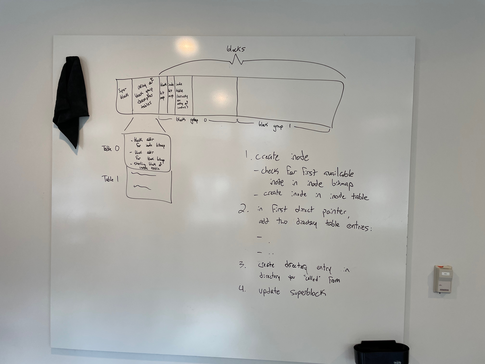

# Will ext2 project

In this project I implemented `cat` and explored what it would take to implement `mkdir`

## `cat`

My implementation of cat correctly traverses the direct, indirect, doubly indirect, and triply indirect pointers of a inode in order to print its contents to the terminal.

It's one thing to implement `cat`, but it's another thing to know whether or not the implementation is working as intended. The provided example filesystem with our project does not contain files sufficient to test the capability of the `cat` command. Thus, it is necessary to extend the provided filesystem. This is done easiest on linux because the linux kernal has native support for ext2. Unfortunately, I use Mac OS which does not support the ext2 filesystem. The closest possible work around are proprietary applications that allow an ext2 filesystem to be mounted as read-only, but still do not allow the filesystem to be modified.

### QEMU

QEMU, standing for Quick EMUlator, allows us to emulate an instance of the linux operating system. I downloaded `debian-live-11.6.0-i386-standard.iso` and ran the following commands, inspired by [this](https://www.youtube.com/watch?v=FSHUXe2aMso) video and the [corresponding](https://github.com/oliversavio/youtube-vid-code/tree/main/qemu-virtual-machines-macos) repository, and helped by [this](https://wiki.gentoo.org/wiki/QEMU/Options#Networking) guide:

`qemu-img create -f qcow2 mydisk.qcow2 10G`

```bash
qemu-system-x86_64 \
-m 4G \
-smp 2 \
-cdrom debian-live-11.6.0-i386-standard.iso \
-drive file=mydisk.qcow2,if=virtio \
-vga virtio \
-display default,show-cursor=on \
-usb \
-device usb-tablet \
-cpu host \
-machine type=q35,accel=hvf \
-nic user,hostfwd=tcp:127.0.0.1:9001-:22
```

This created a storage medium that I would be able to install the OS onto, and then the second command booted up the OS image. I followed installation prompts and then rebooted. To boot after the OS has been installed to the virtual disk, I use the same command as before but without the `-cdrom` flag. I wrote the above command to a bash script for convienence. I created a user called `will` and gave the user sudo priviledge.

The `-nic` sets up creates an opening in the network so that I can use OpenSSH to ssh into the vm from my host machine, helped by [this](https://phoenixnap.com/kb/how-to-enable-ssh-on-debian) guide.

Running `ssh will@localhost -p9001` allowed me to copy the relevant files into the debian installation.

### Modifying the filesystem

I copied the `myfs.ext2` filesystem from my host machine into the virtual machine over SSH using the `scp` command:

`scp -P9001 myfs.ext2 will@localhost:/home/will`

#### Device Files

*udev* is a userspace program that manages pheripheral component events like the plugging in of a new hard drive. udev returns control to the kernel during certain events such as loading device drivers. When a hard drive is plugged in either before system boot or during the system runtime, the udev daemon is what triggers the creation of a *device file* in the `/dev` folder. The `/dev` directory stores all device files, which are files that appear as normal files but are in fact an interface to a peripheral device like a hard drive. Hard drives are assigned device files called *block special files* or *block devices*, which are accessed via a buffer.

The operating system has a root filesystem that contains an executables and libraries necessary to boot. The `mount` command binds a directory in the root filesystem to the root of another file system. This enables the operating system to interact with the mounted file system through the root filesystem. Therefore, interacting with the files in a filesystem that lives on a hard drive seperate from the root filesystem is as simple as mounting that secondary hard drive's filesystem.

However, in our situation, we do not have a seperate hard drive that our filesystem lives on. In fact, our filesystem is stored as a file. How do we mount a file to our root directory?

#### Loop Devices

*Loop devices* are a type of device file that allows a file to be treated as a block device. First, a file is associated with a loop device using `losetup`, which configures the loop device to act as if it were a block device that stored the contents of the file. Then, the loop device can be mounted as any other device file would be.

I mounted the filesystem to the VM using an argument in `mount` that performed both the loop device association and device file mounting in one command:

```shell
sudo mount -o loop ./myfs.ext2 /mnt
```

Once the filesystem was mounted, I ran the following command to create a text file containing the bee movie script:

```shell
sudo curl https://gist.githubusercontent.com/MattIPv4/045239bc27b16b2bcf7a3a9a4648c08a/raw/2411e31293a35f3e565f61e7490a806d4720ea7e/bee%2520movie%2520script -o beemovie.txt
```

I copied the file back to my host system and replaced the `myfs.ext2` filesystem with this modified version. The 12 direct pointers in an inode can store 12\*1024 bytes, and a singly indirect pointer can store 256\*1024, a combined total of 274,432 bytes.  `beemovie.txt` is 49,474 bytes, which means it requires a singly indirect pointer to store its data.

I also generated a file called `long.txt` that contained 1,000,000 bytes of text. This means that `cat` can be verified as correctly traversing doubly indirect block pointers if `long.txt` is properly printed to the terminal. However, in the filesystem provided, there are not enough blocks available to be written to in order for any file to require a triply indirect block. Therefore, I was not able to test my code that navigates the triply indirect block pointer, but I did write it.

## `mkdir`

I did not have enough time to finish my implementation of mkdir, but I did ask and answer a number of questions that came up during my exploratory research.

### Questions

#### Do all inodes exist when the filesystem is created?

Yes, because a file system has a [Block Group Descriptor Table](https://wiki.osdev.org/Ext2#Block_Group_Descriptor_Table) that keeps track of an inode usage bitmap which tells you of the inodes that exist for a given block group, which have already been allocated and which are unclaimed.

#### What is an inode address vs the block it is stored at?

Inode address is a global int that refernences the inode, you can use that number to determine what block group it is in as well as what the index into the relevant inode table.

#### What determines entry size in a directory entry?

There are constant size header bytes and then a variable number of characters that represent the entrie's name, though the length of the name is stored as 1 byte in the header. Therefore, the maximum length of a directory entry name in ext2 is limited to 255 characters.

| Starting Byte | Ending Byte | Size in Bytes | Field Description                                            |
| ------------- | ----------- | ------------- | ------------------------------------------------------------ |
| 0             | 3           | 4             | Inode                                                        |
| 4             | 5           | 2             | Total size of this entry (Including all subfields)           |
| 6             | 6           | 1             | Name Length least-significant 8 bits                         |
| 7             | 7           | 1             | [Type indicator](https://wiki.osdev.org/Ext2#Directory_Entry_Type_Indicators) (only if the feature bit for "directory entries have file type byte" is set, else this is the most-significant 8 bits of the Name Length) |
| 8             | 8+N-1       | N             | Name characters                                              |

### Open questions

#### What happens if you have an available inode but not enough data blocks to write to within the given block group?

### Implementation considerations / roadmap

- `read_dir_inode` assumes blocks are contiguous
- directory entires are padded out to fill block 0, this reasoning for this is a mystery



####
